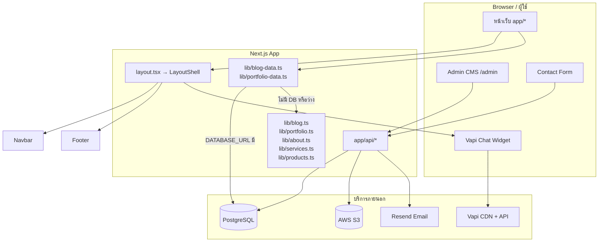

# Klausway — Context โปรเจกต์เว็บไซต์

เอกสารนี้อธิบาย **เว็บไซต์ Klaus Way (Klausway)** ทั้งหมด: โครงสร้าง, หน้าที่, แหล่งข้อมูล, API, บริการภายนอก และ **ว่าส่วนไหนต่อกับอะไรจากไหน**

---

## 1. ภาพรวม

| รายการ | รายละเอียด |
|--------|------------|
| **ชื่อแบรนด์** | Klaus Way (`lib/brand.ts`) |
| **ชื่อแพ็กเกจ npm** | `salesflow-crm-landing` (ชื่อเก่าใน `package.json`) |
| **ประเภท** | Marketing / corporate site + Admin CMS |
| **ธุรกิจ** | IT consulting, custom apps, CRM, integration, automation, cloud, data analytics |
| **Stack** | Next.js 15 (App Router), React 19, TypeScript, Tailwind CSS 3, Prisma 6, PostgreSQL |

เว็บมีสองโหมด deploy ที่สำคัญ:

1. **GitHub Pages (static)** — `GITHUB_PAGES=true` → `output: "export"`, `basePath: /Klausway`, **ไม่มี API / DB**
2. **Server mode (เต็ม)** — `next dev` / `next build` ปกติ → ใช้ `app/api/*`, PostgreSQL, S3, Resend, Admin CMS ได้ครบ

---

## 2. แผนภาพการเชื่อมต่อ (ต่ออะไรจากไหน)



### 2.1 โหมดข้อมูล Blog / Portfolio (สำคัญ)

```
หน้าเว็บ (SSR)
  → getPublishedBlogPosts() / getPortfolioProject()  [lib/blog-data.ts | lib/portfolio-data.ts]
       ├─ ไม่มี DATABASE_URL → ใช้ static ใน lib/blog.ts | lib/portfolio.ts
       ├─ มี DB แต่ query ล้มเหลว → fallback static
       └─ มี DB และมีแถว published → อ่านจาก Prisma → PostgreSQL

Admin CMS
  → fetch apiUrl("/api/admin/blog/...")  [Bearer JWT]
       → verifyAdmin() → lib/admin-auth.ts → lib/auth.ts (jose)
       → Prisma → PostgreSQL
       → อัปโหลดรูป → /api/admin/upload/ → lib/s3.ts → AWS S3
```

### 2.2 Auth flow (Admin)

```
/admin (CmsDashboard)
  → GET /api/admin/setup/     → ตรวจ adminUser.count() === 0 → bootstrap ครั้งแรก
  → POST /api/admin/auth/     → login → JWT 7 วัน (JWT_SECRET หรือ ADMIN_SECRET)
  → POST /api/admin/users/    → สร้าง admin (ต้องมี token หลัง bootstrap)
  → ทุก CRUD blog/portfolio/upload → Header: Authorization: Bearer <token>
```

### 2.3 Contact form

```
ContactForm (client)
  → POST /api/contact/
       → lib/email.ts → Resend
       → ส่งถึง CONTACT_TO (default support@klausway.com)
       → from: NOTIFICATION_FROM
```

### 2.4 Assets & base path

```
next.config.ts
  ├─ GITHUB_PAGES → basePath /Klausway, trailingSlash
  └─ NEXT_PUBLIC_BASE_PATH

lib/asset-path.ts  → ลิงก์รูป/ไอคอน public (Logo.jpg)
lib/api-path.ts    → URL API ลงท้าย / (คู่กับ trailingSlash)
```

---

## 3. โครงสร้างโฟลเดอร์หลัก

```
Klausway/
├── app/                    # Routes (App Router)
│   ├── layout.tsx          # Root metadata + LayoutShell
│   ├── page.tsx            # Home
│   ├── about|apps|blog|contact|portfolio|pricing/
│   ├── blog/[slug]/        # บทความเดี่ยว
│   ├── portfolio/[slug]/   # โปรเจกต์เดี่ยว
│   ├── admin/              # CMS (ไม่มี Navbar/Footer)
│   └── api/                # Route Handlers (server mode เท่านั้น)
├── components/             # UI + animation + admin + feature visuals
├── lib/                    # Data, auth, S3, email, helpers
├── prisma/                 # schema + seed
├── public/                 # Logo.jpg ฯลฯ
├── .github/workflows/      # deploy.yml → GitHub Pages
└── Context.md              # เอกสารนี้
```

---

## 4. หน้าเว็บ (Routes) และสิ่งที่ดึงมา

| Route | ไฟล์ | แหล่งข้อมูล / คอมโพเนนต์หลัก |
|-------|------|------------------------------|
| `/` | `app/page.tsx` | `getPublishedPortfolioProjects()` → Hero, HomeProducts, CtaSection |
| `/about` | `app/about/page.tsx` | **Static** `lib/about.ts` → AboutSection |
| `/apps` | `app/apps/page.tsx` | **Static** `lib/services.ts` → ServicesSection (เมนู Services) |
| `/blog` | `app/blog/page.tsx` | **DB หรือ static** → BlogGrid |
| `/blog/[slug]` | `app/blog/[slug]/page.tsx` | **DB หรือ static** → Rich text |
| `/portfolio` | `app/portfolio/page.tsx` | **DB หรือ static** → PortfolioGrid |
| `/portfolio/[slug]` | `app/portfolio/[slug]/page.tsx` | **DB หรือ static** → PortfolioDetail |
| `/pricing` | `app/pricing/page.tsx` | **Static** ใน PricingCompare |
| `/contact` | `app/contact/page.tsx` | ContactForm → `/api/contact/` |
| `/admin` | `app/admin/page.tsx` | CmsDashboard → Admin API ทั้งชุด |

**Navigation ร่วม:** `lib/navigation.ts` (`routes`, `navItems`, `footerLinks`) ใช้ใน Navbar, Footer, ลิงก์ภายใน

**Layout:**

- `app/layout.tsx` — metadata, dark theme, `LayoutShell`
- `components/layout-shell.tsx` — ถ้า path ขึ้นต้น `/admin` ไม่แสดง Navbar/Footer/Vapi; นอกนั้นแสดง ScrollProgress, Navbar, main, Footer, VapiChatWidget

---

## 5. ข้อมูลแบบ Static (ไม่ผ่าน CMS)

ใช้โดยตรงในคอมโพเนนต์ ไม่ต้องมี DB:

| ไฟล์ | ใช้ที่ |
|------|--------|
| `lib/brand.ts` | ชื่อแบรนด์, tagline |
| `lib/about.ts` | หน้า About |
| `lib/services.ts` | หน้า Services (`/apps`), anchor `#it-consulting` ฯลฯ |
| `lib/products.ts` | HomeProducts, pillars (Klaus Connect ฯลฯ) |
| `lib/portfolio.ts` | ข้อมูล fallback + `portfolioCategories` |
| `lib/blog.ts` | ข้อมูล fallback blog |
| `lib/showcase-dashboard-mock-data.ts` | Hero → ShowcaseDashboardAll (UI demo CRM) |
| `lib/pricing-compare` (ในคอมโพเนนต์) | หน้า Pricing |

**Seed DB:** `npm run db:seed` คัดลอก blog/portfolio จาก static เข้า PostgreSQL (`prisma/seed.ts`)

---

## 6. ฐานข้อมูล (Prisma / PostgreSQL)

**Schema:** `prisma/schema.prisma`

| Model | ใช้งาน |
|-------|--------|
| `AdminUser` | Login CMS, จัดการผู้ใช้ admin |
| `BlogPost` | บทความ (slug, rich content, cover, gallery, published) |
| `PortfolioProject` | ผลงาน (categories, tags, features, benefits, …) |
| `PageContent` | **ยังไม่มีโค้ดใช้** — เตรียมไว้สำหรับ editable pages ในอนาคต |

**Client:** `lib/db.ts` — Prisma singleton (dev ใช้ global cache)

---

## 7. API Routes

ทุก path ควรมี **trailing slash** เมื่อเรียกจาก client (`apiUrl()` ใน `lib/api-path.ts`)

### 7.1 Public (ไม่ต้อง login)

| Method | Path | ทำอะไร |
|--------|------|--------|
| GET | `/api/blog/` | รายการ blog ที่ publish |
| GET | `/api/blog/[slug]/` | บทความเดียว |
| GET | `/api/portfolio/` | รายการ portfolio ที่ publish |
| GET | `/api/portfolio/[slug]/` | โปรเจกต์เดียว |
| POST | `/api/contact/` | ส่งอีเมลติดต่อ |

### 7.2 Admin (Bearer JWT)

| Method | Path | ทำอะไร |
|--------|------|--------|
| GET | `/api/admin/setup/` | `needsBootstrap` ถ้ายังไม่มี admin |
| POST | `/api/admin/auth/` | Login → token + user |
| POST | `/api/admin/register/` | สร้าง admin (deprecated; ใช้ users แทน) |
| GET/POST | `/api/admin/users/` | รายการ / สร้าง admin |
| GET/POST | `/api/admin/blog/` | รายการ / สร้าง post |
| PUT/DELETE | `/api/admin/blog/[slug]/` | แก้ไข / ลบ |
| GET/POST | `/api/admin/portfolio/` | รายการ / สร้าง project |
| PUT/DELETE | `/api/admin/portfolio/[slug]/` | แก้ไข / ลบ |
| POST | `/api/admin/upload/` | อัปโหลดไฟล์ → S3 (form: file, folder) |
| POST | `/api/upload/` | เหมือน admin upload (ต้อง auth เช่นกัน) |

**Auth helpers:**

- `lib/auth.ts` — bcrypt, JWT sign/verify (jose)
- `lib/admin-auth.ts` — `verifyAdmin(request)`, `unauthorizedResponse()`

**Rich text:** บันทึกผ่าน CMS → sanitize ด้วย `lib/rich-text.ts` (DOMPurify) → แสดงด้วย `components/rich-text-content.tsx`

---

## 8. บริการภายนอก (Environment)

คัดลอกจาก `.env.example` → `.env.local`

| ตัวแปร | ต่อกับ | ใช้เมื่อ |
|--------|--------|---------|
| `DATABASE_URL` | PostgreSQL | Blog/Portfolio/Admin จาก DB |
| `AWS_*`, `S3_*` | AWS S3 bucket `kw-doc`, prefix `klausway_website/` | อัปโหลดรูป CMS |
| `RESEND_API_KEY`, `NOTIFICATION_FROM`, `CONTACT_TO` | Resend | ฟอร์ม Contact |
| `JWT_SECRET` / `ADMIN_SECRET` | JWT ลงชื่อ admin | Login CMS |
| `NEXT_PUBLIC_SITE_URL` | metadataBase, OG | SEO |
| `GITHUB_PAGES` | build แบบ static | CI GitHub Pages |
| `NEXT_PUBLIC_BASE_PATH` | ตั้งโดย next.config | ลิงก์ asset บน Pages |

---

## 9. Admin CMS (`/admin`)

**คอมโพเนนต์หลัก:**

- `components/admin/cms-dashboard.tsx` — state ทั้งหมด, CRUD, preview
- `components/admin/admin-auth-panel.tsx` — login / bootstrap
- `components/admin/admin-shell.tsx` — sidebar sections
- `components/admin/image-fields.tsx` — cover + gallery → เรียก upload API
- `components/admin/rich-text-editor.tsx` — editor เนื้อหา blog/portfolio
- `components/admin/content-previews.tsx` — preview การ์ด/รายละเอียด

**Sections:** overview, blog, portfolio, users, settings (ตาม `AdminSection` ใน admin-shell)

**Flow เริ่มต้น:**

1. เปิด `/admin` → เรียก setup → ถ้า `needsBootstrap` แสดงฟอร์มสร้าง admin คนแรก
2. Login → เก็บ token (client state) → โหลด blog/portfolio/users
3. แก้ไข → PUT/POST/DELETE + อัปโหลดรูป S3 → URL เก็บใน `coverImage` / `galleryImages`

---

## 10. UI / คอมโพเนนต์สำคัญ (ไม่ต่อ API)

| กลุ่ม | ไฟล์ | หมายเหตุ |
|-------|------|----------|
| Animation | `components/animation/*` | Reveal, counter, scroll progress, ambient |
| Feature visuals | `components/feature-visuals/*` | ภาพประกอบฟีเจอร์ (inbox, pipeline, AI ฯลฯ) |
| Showcase | `showcase-dashboard-all.tsx` | Mock CRM dashboard บน Hero |
| Vapi | `vapi-chat-widget.tsx` | Voice/chat widget — SDK จาก CDN, keys ฝังในไฟล์ |
| Pricing | `pricing-compare.tsx` | แผน Portal (static) |

---

## 11. Deploy & CI

| ช่องทาง | คำสั่ง / ไฟล์ | ข้อจำกัด |
|---------|----------------|----------|
| **GitHub Pages** | `.github/workflows/deploy.yml` → `npm run build:pages` | Static only; Blog/Portfolio = static; ไม่มี `/admin` API |
| **Vercel / Node host** | `npm run build` + env ครบ | ใช้ API, DB, S3, Resend, Admin ได้ |

`next.config.ts`:

- `trailingSlash: true` — สำคัญกับ `apiUrl()`
- `images.unoptimized: true` — เหมาะกับ static export

---

## 12. คำสั่งพัฒนา

```bash
npm run dev              # Server mode + Turbopack
npm run dev:clean        # ลบ .next แล้ว dev ใหม่
npm run build            # Production (ต้องปิด dev server ก่อน)
npm run build:pages      # Static สำหรับ GitHub Pages

npm run db:push          # sync schema → DB (.env.local)
npm run db:seed          # seed จาก static blog/portfolio
npm run db:studio        # Prisma Studio
```

---

## 13. สรุป: อะไรต่อจากไหน (Quick reference)

| จาก | ไป | ผ่าน |
|-----|-----|------|
| หน้า Blog/Portfolio | ข้อมูล | `*-data.ts` → Prisma **หรือ** `lib/blog.ts` / `lib/portfolio.ts` |
| Contact form | อีเมล | `/api/contact/` → Resend |
| Admin แก้เนื้อหา | DB + รูป | `/api/admin/*` → Prisma + `/api/admin/upload/` → S3 |
| Admin login | JWT | `/api/admin/auth/` → `lib/auth.ts` |
| รูปใน CMS | URL public | S3 `https://{bucket}.s3.{region}.amazonaws.com/...` |
| Navbar/Footer links | หน้าต่างๆ | `lib/navigation.ts` |
| หน้า About/Services/Pricing | ข้อความคงที่ | `lib/about.ts`, `services.ts`, คอมโพเนนต์ pricing |
| Home Hero dashboard | ไม่มี backend | `showcase-dashboard-mock-data.ts` |
| Chat มุมขวาล่าง | Vapi | CDN + Vapi API (keys ใน `vapi-chat-widget.tsx`) |
| GitHub Pages | ไม่มี backend | เฉพาะ static + `assetPath` / `basePath` |

---

## 14. งานที่ยังไม่เชื่อม / ข้อควรรู้

1. **`PageContent` model** — มีใน schema แต่ยังไม่มี API หรือ UI
2. **`/api/upload/`** ซ้ำกับ admin upload และต้อง auth เหมือนกัน — อาจรวม endpoint ในอนาคต
3. **ชื่อ package** `salesflow-crm-landing` ไม่ตรงกับแบรนด์ Klaus Way (cosmetic)
4. **Vapi keys** อยู่ใน source client — ถ้า deploy production ควรพิจารณา env แทนการฝัง hardcode
5. **GitHub Pages** กับ **CMS เต็มรูปแบบ** ใช้พร้อมกันไม่ได้ — ต้อง deploy แบบ server ถ้าต้องการ admin + DB

---

*อัปเดตตาม codebase ณ มิถุนายน 2026 — ถ้าเพิ่ม route, model หรือ integration ใหม่ ควรอัปเดตเอกสารนี้ควบคู่กัน*
